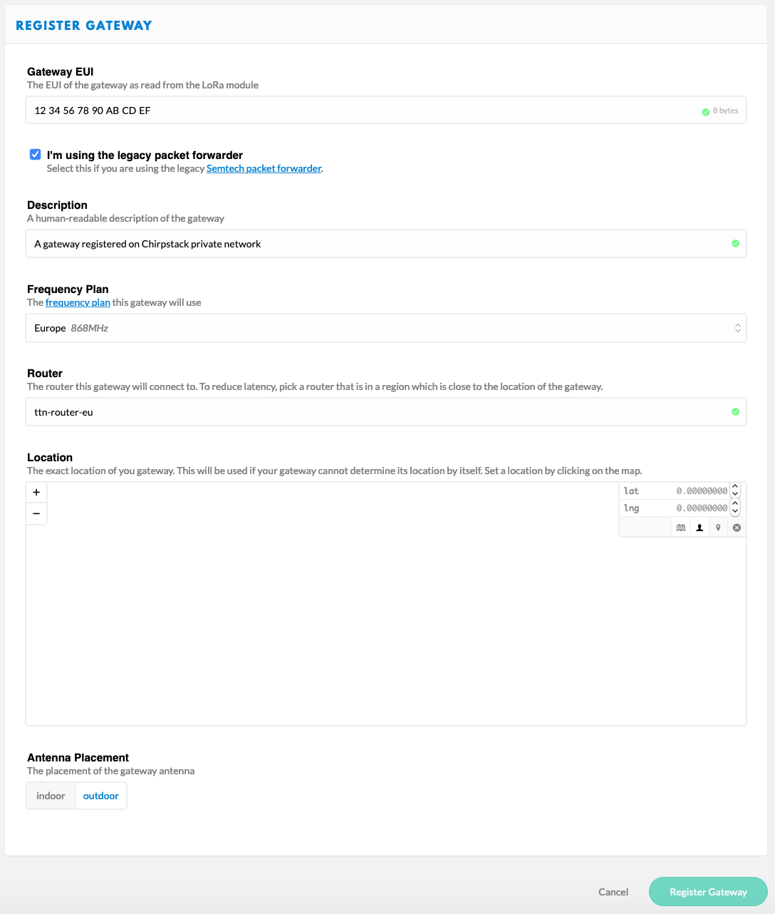

# Simple TTN Bridge
Simple One-Way Bridge between Chirpstack and TTN

The bridge is a NodeRED flow.

You should register the gateways as "legacy packet forwarder" into your [TTN console](https://console.thethingsnetwork.org/gateways/register) in order to enable the traffic.

